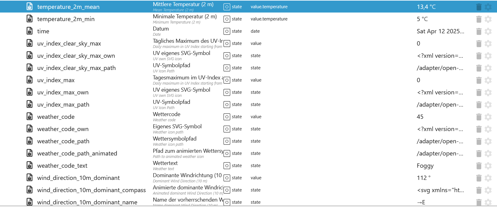
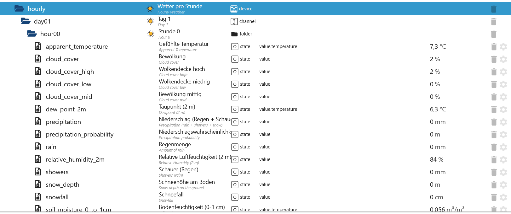
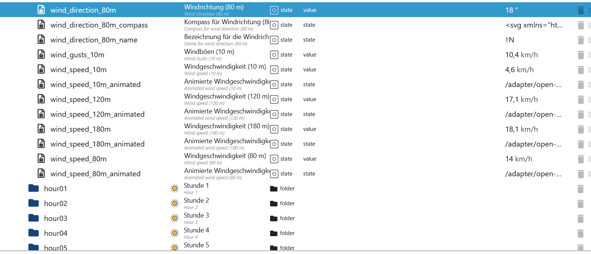

# ioBroker.open-meteo

[Zurück zur README](/README.md)

# Zusammenfassung

- [Instanz Einstellungen](#instanz-einstellungen)
    - [Standard Einstellungen](#standard-instanz-einstellungen)
    - [Stündliche Einstellungen](#stündliche-instanz-einstellungen)
    - [Aktuelle Einstellungen](#aktuelle-instanz-einstellungen)
    - [Tägliche Einstellungen](#tägliche-instanz-einstellungen)
    - [15-Minuten Einstellung](#15-minütliche-instanz-einstellungen)
- [Tägliche States](#objekte-täglich)
- [Aktuelle States](#objekte-aktuell)
- [Stündliche States](#objekte-stündlich)
- [15-Minütliche](#objekte-15-minütlich)
- [Remote Control](#remote-control)

# Instanz Einstellungen

### Standard Instanz Einstellungen

[Zusammenfassung](#zusammenfassung)

| Einstellung                                    | Beschreibung                                                       |
| ---------------------------------------------- | ------------------------------------------------------------------ |
| Systemeinstellungen für die Position verwenden | Zwischen automatisch oder manuell wählen                           |
| Prognosetage                                   | Zwischen 1-7 Tage wählen                                           |
| Aktualisierungsintervall                       | Aktualisierungsintervall in Minuten (max. 10.000 Anfragen pro Tag) |
| Temperatureinheit                              | Zwischen Celsius oder Fahrenheit wählen                            |
| Windgeschwindigkeitseinheit                    | Zwischen km/h, m/s, mph oder knoten wählen                         |
| Niederschlagseinheit                           | Zwischen Millimeter und Zoll wählen                                |
| Timeformat                                     | Wählen zwischen ISO 8610 (z. B. 2025-01-01) oder Unix-Zeitstempel  |
| API-Schlüssel                                  | API-Schlüssel                                                      |
| Maximale Anfragen pro Tag                      | Maximale Abfragen pro Tag. Standard 10000 einer kostenlose API.    |


### Stündliche Instanz Einstellungen

[Zusammenfassung](#zusammenfassung)

| Einstellung                             | Beschreibung                                                                     |
| --------------------------------------- | -------------------------------------------------------------------------------- |
| Temperatur (2 m)                        | Lufttemperatur in 2 Metern Höhe                                                  |
| Temperatur (80 m)                       | Lufttemperatur in 80 Metern Höhe                                                 |
| Temperatur (120 m)                      | Lufttemperatur in 120 Metern Höhe                                                |
| Temperatur (180 m)                      | Lufttemperatur in 180 Metern Höhe                                                |
| Gefühlte Temperatur                     | Gefühlte Temperatur                                                              |
| Niederschlag (Regen + Schauer + Schnee) | Gesamtniederschlag (Regen, Schauer, Schnee) Summe der vorhergehenden Stunde      |
| Niederschlagswahrscheinlichkeit         | Niederschlagswahrscheinlichkeit mit mehr als 0,1 mm in der vorhergehenden Stunde |
| Wettercode                              | Wetterbedingungen als Zahlencode und Zeichenfolge                                |
| Windgeschwindigkeit (10 m)              | Windgeschwindigkeit in 10 Metern Höhe                                            |
| Windgeschwindigkeit (80 m)              | Windgeschwindigkeit in 80 Metern Höhe                                            |
| Windgeschwindigkeit (120 m)             | Windgeschwindigkeit in 120 Metern Höhe                                           |
| Windgeschwindigkeit (180 m)             | Windgeschwindigkeit in 180 Metern Höhe                                           |
| Windrichtung (10 m)                     | Windrichtung in 10 Metern Höhe                                                   |
| Windrichtung (80 m)                     | Windrichtung in 80 Metern Höhe                                                   |
| Windrichtung (120 m)                    | Windrichtung in 120 Metern Höhe                                                  |
| Windrichtung (180 m)                    | Windrichtung in 180 Metern Höhe                                                  |
| Windböen (10 m)                         | Böen in 10 Metern Höhe als Maximum der vorangegangenen Stunde                    |
| Relative Luftfeuchtigkeit (2 m)         | Relative Luftfeuchtigkeit in 2 Metern Höhe                                       |
| Regen                                   | Regen aus Großwetterlagen der letzten Stunde in Millimeter                       |
| Schauer                                 | Schauer aus konvektivem Niederschlag in Millimetern der letzten Stunde           |
| Schneefall                              | Schneefallmenge der letzten Stunde in Zentimetern                                |
| Schneetiefe                             | Schneehöhe auf dem Boden                                                         |
| Bodentemperatur (0 cm)                  | Temperatur im Boden in 0 cm Tiefe                                                |
| Bodentemperatur (6 cm)                  | Temperatur im Boden in 6 cm Tiefe                                                |
| Bodentemperatur (18 cm)                 | Temperatur im Boden in 18 cm Tiefe                                               |
| Bodentemperatur (54 cm)                 | Temperatur im Boden in 54 cm Tiefe                                               |
| Bodenfeuchtigkeit (0-1 cm)              | Durchschnittlicher Bodenwassergehalt als Mischungsverhältnis in 0-1 cm Tiefe     |
| Bodenfeuchtigkeit (1-3 cm)              | Durchschnittlicher Bodenwassergehalt als Mischungsverhältnis in 1-3 cm Tiefe     |
| Bodenfeuchtigkeit (3-9 cm)              | Durchschnittlicher Bodenwassergehalt als Mischungsverhältnis in 3-9 cm Tiefe     |
| Bodenfeuchtigkeit (9-27 cm)             | Durchschnittlicher Bodenwassergehalt als Mischungsverhältnis in 9-27 cm Tiefe    |
| Bodenfeuchtigkeit (27-81 cm)            | Durchschnittlicher Bodenwassergehalt als Mischungsverhältnis in 27-81 cm Tiefe   |
| Betrachtungsabstand                     | Betrachtungsdistanz in Metern                                                    |
| Wolkendecke                             | Gesamtbewölkung als Flächenanteil                                                |
| Wolkendecke niedrig                     | Niedrige Wolken und Nebel bis zu 3 km Höhe                                       |
| Wolkendecke mittel                      | Mittlere Wolkenhöhe von 3 bis 8 km Höhe                                          |
| Wolkendecke hoch                        | Hohe Wolken ab 8 km Höhe                                                         |
| Taupunkt                                | Taupunkttemperatur in 2 Metern Höhe über dem Boden                               |

</br>


### Aktuelle Instanz Einstellungen

[Zusammenfassung](#zusammenfassung)

| Einstellung                              | Beschreibung                                                                     |
| ---------------------------------------- | -------------------------------------------------------------------------------- |
| Minimale gefühlte Temperatur (2 m)       | Minimale gefühlte Tagestemperatur                                                |
| Maximale gefühlte Temperatur (2 m)       | Maximale gefühlte Tagestemperatur                                                |
| Mindesttemperatur (2 m)                  | Minimale tägliche Lufttemperatur in 2 Metern Höhe                                |
| Maximale Temperatur (2 m)                | Maximale tägliche Lufttemperatur in 2 Metern Höhe                                |
| Niederschlagssumme                       | Summe der täglichen Niederschläge (einschließlich Regen, Schauer und Schneefall) |
| Maximale Niederschlagswahrscheinlichkeit | Niederschlagswahrscheinlichkeit                                                  |
| Niederschlagszeiten                      | Anzahl der Stunden mit Regen                                                     |
| Wettercode                               | Die härteste Wetterlage an einem bestimmten Tag                                  |
| Maximale Windgeschwindigkeit (10 m)      | Maximale Windgeschwindigkeit an einem Tag                                        |
| Dominante Windrichtung (10 m)            | Dominante Windrichtung                                                           |
| Maximale Windböen (10 m)                 | Maximale Windböen an einem Tag                                                   |
| Regensumme                               | Summe des täglichen Regens                                                       |
| Schauer Summe                            | Summe der täglichen Regenschauer                                                 |
| Schneefallsumme                          | Summe des täglichen Schneefalls                                                  |
| Sonnenscheindauer                        | Anzahl der Sonnensekunden pro Tag                                                |
| Tageslichtdauer                          | Anzahl der Tageslichtsekunden pro Tag                                            |
| Wolkendecke                              | Gesamtbewölkung als Flächenanteil                                                |


### Tägliche Instanz Einstellungen

[Zusammenfassung](#zusammenfassung)

| Einstellung                     | Beschreibung                                                           |
| ------------------------------- | ---------------------------------------------------------------------- |
| Temperatur (2 m)                | Lufttemperatur in 2 Metern Höhe                                        |
| Gefühlte Temperatur             | Gefühlte Temperatur                                                    |
| Niederschlag                    | Gesamtniederschlag (Regen, Schauer, Schnee) Summe der letzten Stunde   |
| Wettercode                      | Wetterbedingung als numerischer Code und Zeichenfolge                  |
| Windgeschwindigkeit (10 m)      | Windgeschwindigkeit in 10 Metern Höhe                                  |
| Windrichtung (10 m)             | Windrichtung in 10 Metern Höhe                                         |
| Windböen (10 m)                 | Böen in 10 Metern Höhe als Maximum der letzten Stunde                  |
| Relative Luftfeuchtigkeit (2 m) | Relative Luftfeuchtigkeit in 2 Metern Höhe                             |
| Regen                           | Regen aus großräumigen Wettersystemen der letzten Stunde in Millimeter |
| Schauer                         | Schauer aus konvektivem Niederschlag in Millimeter der letzten Stunde  |
| Schneefall                      | Schneefallmenge der letzten Stunde in Zentimetern                      |
| UV-Index                        | Tagesmaximum im UV-Index ab 0                                          |
| UV-Index bei klarerm Himmel     | Tägliches Maximum des UV-Index ab 0 bei wolkenlosen Bedingungen        |


### 15-Minütliche Instanz Einstellungen

[Zusammenfassung](#zusammenfassung)

| Einstellung                             | Beschreibung                                                                |
| --------------------------------------- | --------------------------------------------------------------------------- |
| Niederschlag (Regen + Schauer + Schnee) | Gesamtniederschlag (Regen, Schauer, Schnee) Summe der vorhergehenden Stunde |
| Gefrierhöhe                             | Höhe über dem Meeresspiegel der 0°C-Marke                                   |
| Sonnenscheindauer                       | Anzahl der Sonnensekunden pro Tag                                           |
| Regen                                   | Wetterbedingung als numerischer Code und Zeichenfolge                       |
| KAP                                     | Konvektiv verfügbare potentielle Energie                                    |
| Schneefall                              | Schneefallmenge der letzten Stunde in Zentimetern                           |
| Blitzpotential Index LPI                | Der Blitz Potential Index                                                   |
| Schneefallhöhe                          | Höhe der Schneefallgrenze über dem Meeresspiegel                            |
| Ist Tag oder Nacht                      | true für Tag und false für Nacht                                            |


### Objekte Aktuell

[Zusammenfassung](#zusammenfassung)

| Objekte              | Beschreibung                                                                                                                                                                          |
| -------------------- | ------------------------------------------------------------------------------------------------------------------------------------------------------------------------------------- |
| apparent_temperature | Die gefühlte Temperatur ist die gefühlte Temperatur, die sich aus Windchill-Faktor, relativer Luftfeuchtigkeit und Sonneneinstrahlung zusammensetzt.                                  |
| cloud_cover          | Gesamtbewölkung als Flächenanteil                                                                                                                                                     |
| precipitation        | Gesamtniederschlag (Regen, Schauer, Schnee) Summe der vorhergehenden Stunde                                                                                                           |
| rain                 | Regen aus Großwetterlagen der letzten Stunde in Millimeter                                                                                                                            |
| relative_humidity_2m | Relative Luftfeuchtigkeit in 2 Metern Höhe                                                                                                                                            |
| showers              | Schauer aus konvektivem Niederschlag in Millimetern der letzten Stunde                                                                                                                |
| snowfall             | Schneefallmenge der letzten Stunde in Zentimetern. Um das Wasseräquivalent in Millimetern zu erhalten, dividiere durch 7. Beispiel: 7 cm Schnee = 10 mm Niederschlagswasseräquivalent |
| temperature_2m       | Lufttemperatur in 2 Metern Höhe                                                                                                                                                       |
| time                 | Datum                                                                                                                                                                                 |
| weather_code         | Wetterbedingungen als numerische code.                                                                                                                                                |
| weather_code_text    | Wetterbedingungen als Zeichenfolge.                                                                                                                                                   |
| wind_speed_10m       | Windgeschwindigkeit in 10 Metern Höhe über Grund.                                                                                                                                     |


### Objekte Täglich

[Zusammenfassung](#zusammenfassung)

| Objekte                       | Beschreibung                                                                                                                                       |
| ----------------------------- | -------------------------------------------------------------------------------------------------------------------------------------------------- |
| apparent_temperature_max      | Maximum daily apparent temperature                                                                                                                 |
| apparent_temperature_min      | Minimum daily apparent temperature                                                                                                                 |
| daylight_duration             | Anzahl der Sekunden Tageslicht pro Tag                                                                                                             |
| precipitation_hours           | Die Anzahl der Stunden mit Regen                                                                                                                   |
| precipitation_probability_max | Summe der täglichen Niederschlagsmengen (einschließlich Regen, Schauer und Schneefall)                                                             |
| precipitation_sum             | Summe der täglichen Niederschlagsmengen (einschließlich Regen, Schauer und Schneefall)                                                             |
| rain_sum                      | Summe des täglichen Niederschlags                                                                                                                  |
| showers_sum                   | Summe der täglichen Regenfälle                                                                                                                     |
| snowfall_sum                  | Summe der täglichen Schneefälle                                                                                                                    |
| sunshine_duration             | Anzahl der Sonnenscheinsekunden der vorangegangenen Stunde pro Stunde, berechnet durch die direkte normalisierte Bestrahlungsstärke über 120 W/m². |
| temperature_2m_max            | Maximum tägliche Lufttemperatur in 2 Metern Höhe                                                                                                   |
| temperature_2m_min            | Minimum tägliche Lufttemperatur in 2 Metern Höhe                                                                                                   |
| time                          | Datum                                                                                                                                              |
| uv_index_clear_sky_max        | UV-Index bei klarem Himmel                                                                                                                         |
| uv_index_max                  | UV Index                                                                                                                                           |
| weather_code                  | Wetterbedingungen als numerische code.                                                                                                             |
| weather_code_text             | Wetterbedingungen als Zeichenfolge.                                                                                                                |
| wind_direction_10m_dominant   | Dominante Windrichtung                                                                                                                             |
| wind_speed_10m_max            | Maximale Windgeschwindigkeit an einem Tag                                                                                                          |
| wind_gusts_10m_max            | Maximale Böengeschwindigkeit an einem Tag                                                                                                          |

</br>


### Objekte Stündlich

[Zusammenfassung](#zusammenfassung)

| Objekte                   | Beschreibung                                                                                                                                                                          |
| ------------------------- | ------------------------------------------------------------------------------------------------------------------------------------------------------------------------------------- |
| apparent_temperature      | Die gefühlte Temperatur ist die gefühlte Temperatur, die sich aus Windchill-Faktor, relativer Luftfeuchtigkeit und Sonneneinstrahlung zusammensetzt.                                  |
| cloud_cover               | Gesamtbewölkung als Flächenanteil                                                                                                                                                     |
| cloud_cover_high          | Hohe Wolken ab 8 km Höhe                                                                                                                                                              |
| cloud_cover_low           | Niedrige Wolken und Nebel bis zu 3 km Höhe                                                                                                                                            |
| cloud_cover_mid           | Mittlere Wolkenhöhe von 3 bis 8 km Höhe                                                                                                                                               |
| dew_point_2m              | Taupunkttemperatur in 2 Metern Höhe über dem Boden                                                                                                                                    |
| precipitation             | Gesamtniederschlag (Regen, Schauer, Schnee) Summe der vorhergehenden Stunde                                                                                                           |
| precipitation_probability | Niederschlagswahrscheinlichkeit                                                                                                                                                       |
| snow_depth                | Schneehöhe auf dem Boden                                                                                                                                                              |
| snowfall                  | Schneefallmenge der letzten Stunde in Zentimetern. Um das Wasseräquivalent in Millimetern zu erhalten, dividiere durch 7. Beispiel: 7 cm Schnee = 10 mm Niederschlagswasseräquivalent |
| soil_moisture_0_to_1_cm   | Durchschnittlicher Bodenwassergehalt als volumetrisches Mischungsverhältnis in 0-1 cm Tiefe.                                                                                          |
| soil_moisture_1_to_3_cm   | Durchschnittlicher Bodenwassergehalt als volumetrisches Mischungsverhältnis in 1-3 cm Tiefe.                                                                                          |
| soil_moisture_27_to_81_cm | Durchschnittlicher Bodenwassergehalt als volumetrisches Mischungsverhältnis in 27-81 cm Tiefe.                                                                                        |
| soil_moisture_3_to_9_cm   | Durchschnittlicher Bodenwassergehalt als volumetrisches Mischungsverhältnis in 3-9 cm Tiefe.                                                                                          |
| soil_moisture_9_to_27_cm  | Durchschnittlicher Bodenwassergehalt als volumetrisches Mischungsverhältnis in 9-27 cm Tiefe.                                                                                         |
| soil_temperature_0cm      | Temperatur im Boden in 0, 6, 18 und 54 cm Tiefe. 0 cm ist die Oberflächentemperatur an Land bzw. die Wasseroberflächentemperatur auf Wasser.                                          |
| soil_temperature_18cm     | Temperatur im Boden in 18 cm Tiefe. 0 cm ist die Oberflächentemperatur an Land bzw. die Wasseroberflächentemperatur auf Wasser.                                                       |
| soil_temperature_54cm     | Temperatur im Boden in 54 cm Tiefe. 0 cm ist die Oberflächentemperatur an Land bzw. die Wasseroberflächentemperatur auf Wasser.                                                       |
| soil_temperature_6cm      | Temperatur im Boden in 6 cm Tiefe. 0 cm ist die Oberflächentemperatur an Land bzw. die Wasseroberflächentemperatur auf Wasser.                                                        |
| temperature_120m          | Lufttemperatur in 120 Metern Höhe                                                                                                                                                     |
| temperature_180m          | Lufttemperatur in 180 Metern Höhe                                                                                                                                                     |
| temperature_2m            | Lufttemperatur in 2 Metern Höhe                                                                                                                                                       |
| temperature_80m           | Lufttemperatur in 80 Metern Höhe                                                                                                                                                      |
| time                      | Datum                                                                                                                                                                                 |
| visibility                | Betrachtungsdistanz in Metern. Beeinflusst durch niedrige Wolken, Luftfeuchtigkeit und Aerosole.                                                                                      |
| weather_code              | Wetterbedingungen als numerische code.                                                                                                                                                |
| weather_code_text         | Wetterbedingungen als Zeichenfolge.                                                                                                                                                   |
| wind_direction_10m        | Windrichtung in 10 Metern Höhe                                                                                                                                                        |
| wind_direction_120m       | Windrichtung in 120 Metern Höhe                                                                                                                                                       |
| wind_direction_180m       | Windrichtung in 180 Metern Höhe                                                                                                                                                       |
| wind_direction_80m        | Windrichtung in 80 Metern Höhe                                                                                                                                                        |
| wind_gusts_10m            | Böen in 10 Metern Höhe als Maximum der vorangegangenen Stunde                                                                                                                         |
| wind_speed_10m            | Windgeschwindigkeit in 10 Metern Höhe über Grund.                                                                                                                                     |
| wind_speed_120m           | Windgeschwindigkeit in 120 Metern Höhe über Grund.                                                                                                                                    |
| wind_speed_180m           | Windgeschwindigkeit in 180 Metern Höhe über Grund.                                                                                                                                    |
| wind_speed_80m            | Windgeschwindigkeit in 80 Metern Höhe über Grund.                                                                                                                                     |

</br>
</br>
</br>
</br>


### Objekte 15-Minütlich

[Zusammenfassung](#zusammenfassung)

| Objekte               | Beschreibung                                                                                                                                                                          |
| --------------------- | ------------------------------------------------------------------------------------------------------------------------------------------------------------------------------------- |
| cape                  | Konvektiv verfügbare potentielle Energie                                                                                                                                              |
| freezing_level_height | Höhe über dem Meeresspiegel der 0°C-Marke                                                                                                                                             |
| is_day                | ist Tag oder Nacgt                                                                                                                                                                    |
| lightning_potential   | Der Blitz Potential Index                                                                                                                                                             |
| precipitation         | Gesamtniederschlag (Regen, Schauer, Schnee) Summe der vorhergehenden Stunde                                                                                                           |
| rain                  | Regen aus Großwetterlagen der letzten Stunde in Millimeter                                                                                                                            |
| snowfall              | Schneefallmenge der letzten Stunde in Zentimetern. Um das Wasseräquivalent in Millimetern zu erhalten, dividiere durch 7. Beispiel: 7 cm Schnee = 10 mm Niederschlagswasseräquivalent |
| snowfall_height       | Höhe der Schneefallgrenze über dem Meeresspiegel                                                                                                                                      |
| sunshine_duration     | Anzahl der Sonnenscheinsekunden der vorangegangenen Stunde pro Stunde, berechnet durch die direkte normalisierte Bestrahlungsstärke über 120 W/m².                                    |
| time                  | Datum                                                                                                                                                                                 |

</br>
</br>


### Remote Control

[Zusammenfassung](#zusammenfassung)

| Objekte     | Beschreibung                                             |
| ----------- | -------------------------------------------------------- |
| last_update | Letzte Update                                            |
| param       | Eigene Parameters (siehe https://open-meteo.com/en/docs) |
| result      | Ergebnis eigene Parameter oder Intervallabfrage          |
| status      | Status und Counter der Abfragen                          |
| update      | Manuelles Update                                         |

### Status JSON

```json
{
    "countRequest": 8, // Counter pro Abfrage (0.1 pro Variable und 0.75 pro Tag -> Max 14 pro Abfrage)
    "countRequestMax": 10000, // Max Request pro Tag. Standard 10000 pro Tag - Mit API > 30000
    "timestamp": 1742237803609, // Letzte Abfrage als Timestamp
    "timeISO": "2025-03-17T18:56:43.609Z", // Letzte Abfrage als Datum
    "countError": 0, // Counter der Fehler. Wird nach einem Restart zurückgesetzt
    "error": "NoError", // Letzte Fehlermeldung
    "timestampError": 0, // Letzter Fehler als Timestamp
    "lastError": "2025-03-17T18:56:23.083Z", // Letzter Fehler als Datum
    "timestampRestart": 1742237783083, // Letzte Adapterstart als Timestamp
    "timeISORestart": "2025-03-17T18:56:23.083Z" // Letzte Adapterstart als Datum
}
```


[Zusammenfassung](#zusammenfassung)
