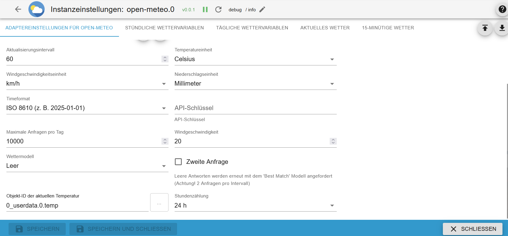
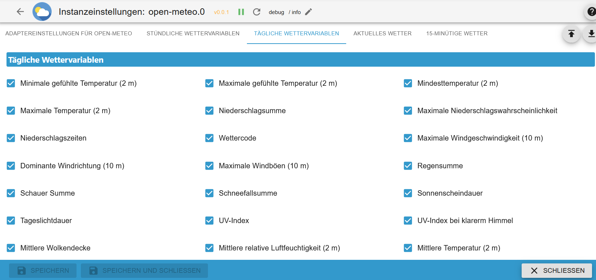
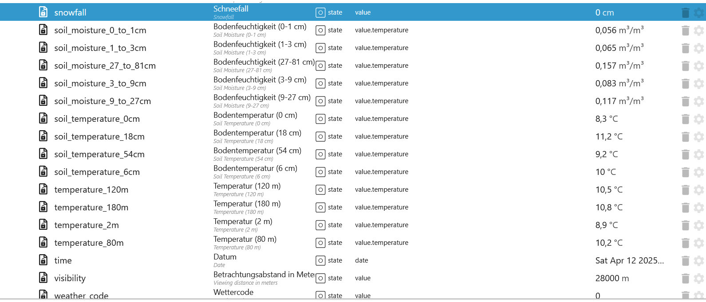
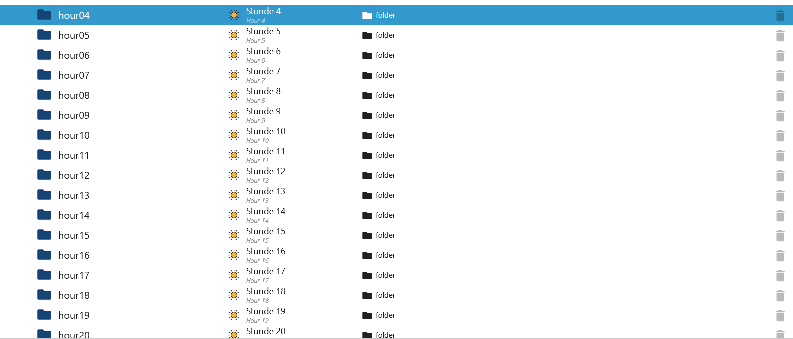
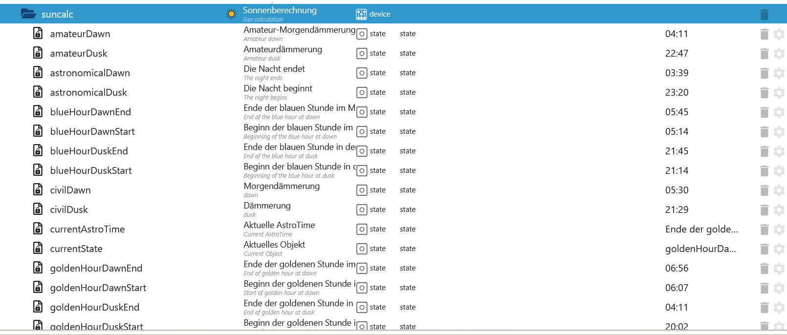
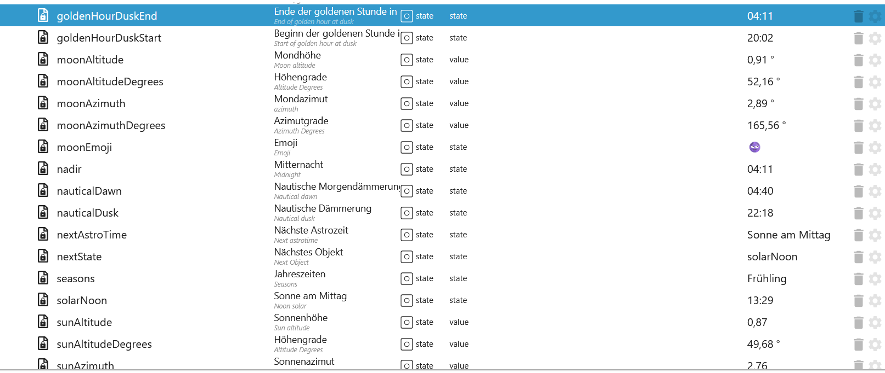
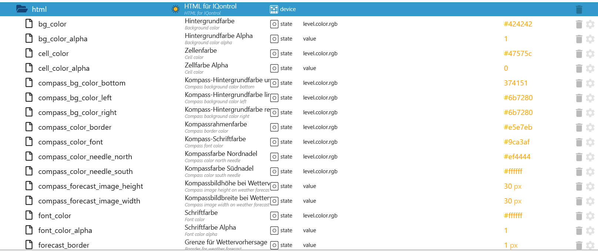
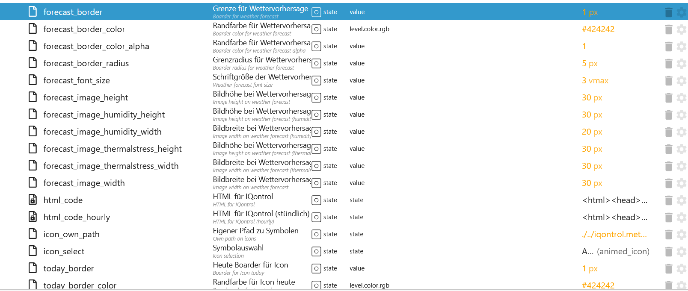

# ioBroker.open-meteo

[Zurück zur README](/README.md)

# Zusammenfassung

- [Instanz Einstellungen](#instanz-einstellungen)
    - [Standard Einstellungen](#standard-instanz-einstellungen)
    - [Stündliche Einstellungen](#stündliche-instanz-einstellungen)
    - [Aktuelle Einstellungen](#aktuelle-instanz-einstellungen)
    - [Tägliche Einstellungen](#tägliche-instanz-einstellungen)
    - [15-Minuten Einstellung](#15-minütliche-instanz-einstellungen)
- [Tägliche States](#objekte-täglich)
- [Aktuelle States](#objekte-aktuell)
- [Stündliche States](#objekte-stündlich)
- [15-Minütliche](#objekte-15-minütlich)
- [Astrozeit](#astrotime)
- [Remote Control](#remote-control)
- [Farbe Icons](#icon-farben)
- [Wetter Code](#wetter-code)
- [IQontrol](#iqontrol)
- [Thermische Belastung](#thermische-belastung)

# Instanz Einstellungen

### Standard Instanz Einstellungen

[Zusammenfassung](#zusammenfassung)

| Einstellung                                    | Beschreibung                                                          |
| ---------------------------------------------- | --------------------------------------------------------------------- |
| Systemeinstellungen für die Position verwenden | Zwischen automatisch oder manuell wählen                              |
| Prognosetage                                   | Zwischen 1-7 Tage wählen                                              |
| Aktualisierungsintervall                       | Aktualisierungsintervall in Minuten (max. 10.000 Anfragen pro Tag)    |
| Temperatureinheit                              | Zwischen Celsius oder Fahrenheit wählen                               |
| Windgeschwindigkeitseinheit                    | Zwischen km/h, m/s, mph oder knoten wählen                            |
| Niederschlagseinheit                           | Zwischen Millimeter und Zoll wählen                                   |
| Timeformat                                     | Wählen zwischen ISO 8610 (z. B. 2025-01-01) oder Unix-Zeitstempel     |
| API-Schlüssel                                  | API-Schlüssel                                                         |
| Maximale Anfragen pro Tag                      | Maximale Abfragen pro Tag. Standard 10000 einer kostenlose API.       |
| Windgeschwindigkeit                            | Geschwindigkeit ab dem Wind Icons angezeigt werden                    |
| Wettermodell                                   | Siehe [open-meteo.com](https://open-meteo.com)                        |
| Zweite Anfrage                                 | Leere Antworten werden erneut mit dem 'Best Match' Modell angefordert |
| Objekt-ID der aktuellen Temperatur             | Aktuelle Temperatur für IQontrol                                      |
| Stundenzählung                                 | Wechseln zwischen 24 oder 12 Stundenanzeige                           |

</br>


### Stündliche Instanz Einstellungen

[Zusammenfassung](#zusammenfassung)

| Einstellung                             | Beschreibung                                                                     |
| --------------------------------------- | -------------------------------------------------------------------------------- |
| Temperatur (2 m)                        | Lufttemperatur in 2 Metern Höhe                                                  |
| Temperatur (80 m)                       | Lufttemperatur in 80 Metern Höhe                                                 |
| Temperatur (120 m)                      | Lufttemperatur in 120 Metern Höhe                                                |
| Temperatur (180 m)                      | Lufttemperatur in 180 Metern Höhe                                                |
| Gefühlte Temperatur                     | Gefühlte Temperatur                                                              |
| Niederschlag (Regen + Schauer + Schnee) | Gesamtniederschlag (Regen, Schauer, Schnee) Summe der vorhergehenden Stunde      |
| Niederschlagswahrscheinlichkeit         | Niederschlagswahrscheinlichkeit mit mehr als 0,1 mm in der vorhergehenden Stunde |
| Wettercode                              | Wetterbedingungen als Zahlencode und Zeichenfolge                                |
| Windgeschwindigkeit (10 m)              | Windgeschwindigkeit in 10 Metern Höhe                                            |
| Windgeschwindigkeit (80 m)              | Windgeschwindigkeit in 80 Metern Höhe                                            |
| Windgeschwindigkeit (120 m)             | Windgeschwindigkeit in 120 Metern Höhe                                           |
| Windgeschwindigkeit (180 m)             | Windgeschwindigkeit in 180 Metern Höhe                                           |
| Windrichtung (10 m)                     | Windrichtung in 10 Metern Höhe                                                   |
| Windrichtung (80 m)                     | Windrichtung in 80 Metern Höhe                                                   |
| Windrichtung (120 m)                    | Windrichtung in 120 Metern Höhe                                                  |
| Windrichtung (180 m)                    | Windrichtung in 180 Metern Höhe                                                  |
| Windböen (10 m)                         | Böen in 10 Metern Höhe als Maximum der vorangegangenen Stunde                    |
| Relative Luftfeuchtigkeit (2 m)         | Relative Luftfeuchtigkeit in 2 Metern Höhe                                       |
| Regen                                   | Regen aus Gro릉etterlagen der letzten Stunde in Millimeter                       |
| Schauer                                 | Schauer aus konvektivem Niederschlag in Millimetern der letzten Stunde           |
| Schneefall                              | Schneefallmenge der letzten Stunde in Zentimetern                                |
| Schneetiefe                             | Schneehöhe auf dem Boden                                                         |
| Bodentemperatur (0 cm)                  | Temperatur im Boden in 0 cm Tiefe                                                |
| Bodentemperatur (6 cm)                  | Temperatur im Boden in 6 cm Tiefe                                                |
| Bodentemperatur (18 cm)                 | Temperatur im Boden in 18 cm Tiefe                                               |
| Bodentemperatur (54 cm)                 | Temperatur im Boden in 54 cm Tiefe                                               |
| Bodenfeuchtigkeit (0-1 cm)              | Durchschnittlicher Bodenwassergehalt als Mischungsverhältnis in 0-1 cm Tiefe     |
| Bodenfeuchtigkeit (1-3 cm)              | Durchschnittlicher Bodenwassergehalt als Mischungsverhältnis in 1-3 cm Tiefe     |
| Bodenfeuchtigkeit (3-9 cm)              | Durchschnittlicher Bodenwassergehalt als Mischungsverhältnis in 3-9 cm Tiefe     |
| Bodenfeuchtigkeit (9-27 cm)             | Durchschnittlicher Bodenwassergehalt als Mischungsverhältnis in 9-27 cm Tiefe    |
| Bodenfeuchtigkeit (27-81 cm)            | Durchschnittlicher Bodenwassergehalt als Mischungsverhältnis in 27-81 cm Tiefe   |
| Betrachtungsabstand                     | Betrachtungsdistanz in Metern                                                    |
| Wolkendecke                             | Gesamtbewölkung als Flächenanteil                                                |
| Wolkendecke niedrig                     | Niedrige Wolken und Nebel bis zu 3 km Höhe                                       |
| Wolkendecke mittel                      | Mittlere Wolkenhöhe von 3 bis 8 km Höhe                                          |
| Wolkendecke hoch                        | Hohe Wolken ab 8 km Höhe                                                         |
| Taupunkt                                | Taupunkttemperatur in 2 Metern Höhe über dem Boden                               |

</br>


### Aktuelle Instanz Einstellungen

[Zusammenfassung](#zusammenfassung)

| Einstellung                              | Beschreibung                                                                     |
| ---------------------------------------- | -------------------------------------------------------------------------------- |
| Minimale gefühlte Temperatur (2 m)       | Minimale gefühlte Tagestemperatur                                                |
| Maximale gefühlte Temperatur (2 m)       | Maximale gefühlte Tagestemperatur                                                |
| Mindesttemperatur (2 m)                  | Minimale tägliche Lufttemperatur in 2 Metern Höhe                                |
| Maximale Temperatur (2 m)                | Maximale tägliche Lufttemperatur in 2 Metern Höhe                                |
| Niederschlagssumme                       | Summe der täglichen Niederschläge (einschlie륿ich Regen, Schauer und Schneefall) |
| Maximale Niederschlagswahrscheinlichkeit | Niederschlagswahrscheinlichkeit                                                  |
| Niederschlagszeiten                      | Anzahl der Stunden mit Regen                                                     |
| Wettercode                               | Die härteste Wetterlage an einem bestimmten Tag                                  |
| Maximale Windgeschwindigkeit (10 m)      | Maximale Windgeschwindigkeit an einem Tag                                        |
| Dominante Windrichtung (10 m)            | Dominante Windrichtung                                                           |
| Maximale Windböen (10 m)                 | Maximale Windböen an einem Tag                                                   |
| Regensumme                               | Summe des täglichen Regens                                                       |
| Schauer Summe                            | Summe der täglichen Regenschauer                                                 |
| Schneefallsumme                          | Summe des täglichen Schneefalls                                                  |
| Sonnenscheindauer                        | Anzahl der Sonnensekunden pro Tag                                                |
| Tageslichtdauer                          | Anzahl der Tageslichtsekunden pro Tag                                            |
| Wolkendecke                              | Gesamtbewölkung als Flächenanteil                                                |


### Tägliche Instanz Einstellungen

[Zusammenfassung](#zusammenfassung)

| Einstellung                              | Beschreibung                                                           |
| ---------------------------------------- | ---------------------------------------------------------------------- |
| Temperatur (2 m)                         | Lufttemperatur in 2 Metern Höhe                                        |
| Gefühlte Temperatur                      | Gefühlte Temperatur                                                    |
| Niederschlag                             | Gesamtniederschlag (Regen, Schauer, Schnee) Summe der letzten Stunde   |
| Wettercode                               | Wetterbedingung als numerischer Code und Zeichenfolge                  |
| Windgeschwindigkeit (10 m)               | Windgeschwindigkeit in 10 Metern Höhe                                  |
| Windrichtung (10 m)                      | Windrichtung in 10 Metern Höhe                                         |
| Windböen (10 m)                          | Böen in 10 Metern Höhe als Maximum der letzten Stunde                  |
| Relative Luftfeuchtigkeit (2 m)          | Relative Luftfeuchtigkeit in 2 Metern Höhe                             |
| Regen                                    | Regen aus großräumigen Wettersystemen der letzten Stunde in Millimeter |
| Schauer                                  | Schauer aus konvektivem Niederschlag in Millimeter der letzten Stunde  |
| Schneefall                               | Schneefallmenge der letzten Stunde in Zentimetern                      |
| UV-Index                                 | Tagesmaximum im UV-Index ab 0                                          |
| UV-Index bei klarerm Himmel              | Tägliches Maximum des UV-Index ab 0 bei wolkenlosen Bedingungen        |
| Mittlere Wolkendecke                     | Mittlere Wolkendecke                                                   |
| Mittlere relative Luftfeuchtigkeit (2 m) | Mittlere relative Luftfeuchtigkeit in 2 Metern Höhe                    |
| Mittlere Temperatur (2 m)                | Lufttemperatur in 2 Metern Höhe                                        |



### 15-Minütliche Instanz Einstellungen

[Zusammenfassung](#zusammenfassung)

| Einstellung                             | Beschreibung                                                                |
| --------------------------------------- | --------------------------------------------------------------------------- |
| Niederschlag (Regen + Schauer + Schnee) | Gesamtniederschlag (Regen, Schauer, Schnee) Summe der vorhergehenden Stunde |
| Gefrierhöhe                             | Höhe über dem Meeresspiegel der 0°C-Marke                                   |
| Sonnenscheindauer                       | Anzahl der Sonnensekunden pro Tag                                           |
| Regen                                   | Wetterbedingung als numerischer Code und Zeichenfolge                       |
| KAP                                     | Konvektiv verfügbare potentielle Energie                                    |
| Schneefall                              | Schneefallmenge der letzten Stunde in Zentimetern                           |
| Blitzpotential Index LPI                | Der Blitz Potential Index                                                   |
| Schneefallhöhe                          | Höhe der Schneefallgrenze über dem Meeresspiegel                            |
| Ist Tag oder Nacht                      | true für Tag und false für Nacht                                            |


### Objekte Aktuell

[Zusammenfassung](#zusammenfassung)

| Objekte              | Beschreibung                                                                                                                                                                          |
| -------------------- | ------------------------------------------------------------------------------------------------------------------------------------------------------------------------------------- |
| apparent_temperature | Die gefühlte Temperatur ist die gefühlte Temperatur, die sich aus Windchill-Faktor, relativer Luftfeuchtigkeit und Sonneneinstrahlung zusammensetzt.                                  |
| cloud_cover          | Gesamtbewölkung als Flächenanteil                                                                                                                                                     |
| precipitation        | Gesamtniederschlag (Regen, Schauer, Schnee) Summe der vorhergehenden Stunde                                                                                                           |
| rain                 | Regen aus Gro릉etterlagen der letzten Stunde in Millimeter                                                                                                                            |
| relative_humidity_2m | Relative Luftfeuchtigkeit in 2 Metern Höhe                                                                                                                                            |
| showers              | Schauer aus konvektivem Niederschlag in Millimetern der letzten Stunde                                                                                                                |
| snowfall             | Schneefallmenge der letzten Stunde in Zentimetern. Um das Wasseräquivalent in Millimetern zu erhalten, dividiere durch 7. Beispiel: 7 cm Schnee = 10 mm Niederschlagswasseräquivalent |
| temperature_2m       | Lufttemperatur in 2 Metern Höhe                                                                                                                                                       |
| time                 | Datum                                                                                                                                                                                 |
| weather_code         | Wetterbedingungen als numerische code.                                                                                                                                                |
| weather_code_own     | Eigendes Icon mit den ausgewählten Farben                                                                                                                                             |
| weather_code_path    | Pfad zum Icon                                                                                                                                                                         |
| weather_code_text    | Wetterbedingungen als Zeichenfolge.                                                                                                                                                   |
| wind_speed_10m       | Windgeschwindigkeit in 10 Metern Höhe über Grund.                                                                                                                                     |


### Objekte Täglich

[Zusammenfassung](#zusammenfassung)

| Objekte                       | Beschreibung                                                                                                                                       |
| ----------------------------- | -------------------------------------------------------------------------------------------------------------------------------------------------- |
| apparent_temperature_max      | Maximum daily apparent temperature                                                                                                                 |
| apparent_temperature_min      | Minimum daily apparent temperature                                                                                                                 |
| cloud_cover_mean              | Mittlere Wolkendecke                                                                                                                               |
| daylight_duration             | Anzahl der Sekunden Tageslicht pro Tag                                                                                                             |
| precipitation_hours           | Die Anzahl der Stunden mit Regen                                                                                                                   |
| precipitation_probability_max | Summe der täglichen Niederschlagsmengen (einschlie륿ich Regen, Schauer und Schneefall)                                                             |
| precipitation_sum             | Summe der täglichen Niederschlagsmengen (einschlie륿ich Regen, Schauer und Schneefall)                                                             |
| rain_sum                      | Summe des täglichen Niederschlags                                                                                                                  |
| relative_humidity_2m_mean     | Mittlere relative Luftfeuchtigkeit (2 m)                                                                                                           |
| showers_sum                   | Summe der täglichen Regenfälle                                                                                                                     |
| snowfall_sum                  | Summe der täglichen Schneefälle                                                                                                                    |
| sunshine_duration             | Anzahl der Sonnenscheinsekunden der vorangegangenen Stunde pro Stunde, berechnet durch die direkte normalisierte Bestrahlungsstärke über 120 W/m². |
| temperature_2m_max            | Maximum tägliche Lufttemperatur in 2 Metern Höhe                                                                                                   |
| temperature_2m_mean           | Mittlere Temperatur (2 m)                                                                                                                          |
| temperature_2m_min            | Minimum tägliche Lufttemperatur in 2 Metern Höhe                                                                                                   |
| time                          | Datum                                                                                                                                              |
| uv_index_clear_sky_max        | UV-Index bei klarem Himmel                                                                                                                         |
| uv_index_clear_sky_max_own    | Eigenes Icon mit den ausgewählten Farben                                                                                                           |
| uv_index_clear_sky_max_path   | Pfad zum UV Icon                                                                                                                                   |
| uv_index_max                  | UV Index                                                                                                                                           |
| uv_index_max_own              | Eigenes Icon mit den ausgewählten Farben                                                                                                           |
| uv_index_max_path             | Pfad zum UV Icon                                                                                                                                   |
| weather_code                  | Wetterbedingungen als numerische code.                                                                                                             |
| weather_code_own              | Eigendes Icon mit den ausgewählten Farben                                                                                                          |
| weather_code_path             | Pfad zum Icon                                                                                                                                      |
| weather_code_text             | Wetterbedingungen als Zeichenfolge.                                                                                                                |
| wind_direction_10m_dominant   | Dominante Windrichtung                                                                                                                             |
| wind_speed_10m_max            | Maximale Windgeschwindigkeit an einem Tag                                                                                                          |
| wind_gusts_10m_max            | Maximale Böengeschwindigkeit an einem Tag                                                                                                          |

</br>


### Objekte Stündlich

[Zusammenfassung](#zusammenfassung)

| Objekte                   | Beschreibung                                                                                                                                                                          |
| ------------------------- | ------------------------------------------------------------------------------------------------------------------------------------------------------------------------------------- |
| apparent_temperature      | Die gefühlte Temperatur ist die gefühlte Temperatur, die sich aus Windchill-Faktor, relativer Luftfeuchtigkeit und Sonneneinstrahlung zusammensetzt.                                  |
| cloud_cover               | Gesamtbewölkung als Flächenanteil                                                                                                                                                     |
| cloud_cover_high          | Hohe Wolken ab 8 km Höhe                                                                                                                                                              |
| cloud_cover_low           | Niedrige Wolken und Nebel bis zu 3 km Höhe                                                                                                                                            |
| cloud_cover_mid           | Mittlere Wolkenhöhe von 3 bis 8 km Höhe                                                                                                                                               |
| dew_point_2m              | Taupunkttemperatur in 2 Metern Höhe über dem Boden                                                                                                                                    |
| precipitation             | Gesamtniederschlag (Regen, Schauer, Schnee) Summe der vorhergehenden Stunde                                                                                                           |
| precipitation_probability | Niederschlagswahrscheinlichkeit                                                                                                                                                       |
| snow_depth                | Schneehöhe auf dem Boden                                                                                                                                                              |
| snowfall                  | Schneefallmenge der letzten Stunde in Zentimetern. Um das Wasseräquivalent in Millimetern zu erhalten, dividiere durch 7. Beispiel: 7 cm Schnee = 10 mm Niederschlagswasseräquivalent |
| soil_moisture_0_to_1_cm   | Durchschnittlicher Bodenwassergehalt als volumetrisches Mischungsverhältnis in 0-1 cm Tiefe.                                                                                          |
| soil_moisture_1_to_3_cm   | Durchschnittlicher Bodenwassergehalt als volumetrisches Mischungsverhältnis in 1-3 cm Tiefe.                                                                                          |
| soil_moisture_27_to_81_cm | Durchschnittlicher Bodenwassergehalt als volumetrisches Mischungsverhältnis in 27-81 cm Tiefe.                                                                                        |
| soil_moisture_3_to_9_cm   | Durchschnittlicher Bodenwassergehalt als volumetrisches Mischungsverhältnis in 3-9 cm Tiefe.                                                                                          |
| soil_moisture_9_to_27_cm  | Durchschnittlicher Bodenwassergehalt als volumetrisches Mischungsverhältnis in 9-27 cm Tiefe.                                                                                         |
| soil_temperature_0cm      | Temperatur im Boden in 0, 6, 18 und 54 cm Tiefe. 0 cm ist die Oberflächentemperatur an Land bzw. die Wasseroberflächentemperatur auf Wasser.                                          |
| soil_temperature_18cm     | Temperatur im Boden in 18 cm Tiefe. 0 cm ist die Oberflächentemperatur an Land bzw. die Wasseroberflächentemperatur auf Wasser.                                                       |
| soil_temperature_54cm     | Temperatur im Boden in 54 cm Tiefe. 0 cm ist die Oberflächentemperatur an Land bzw. die Wasseroberflächentemperatur auf Wasser.                                                       |
| soil_temperature_6cm      | Temperatur im Boden in 6 cm Tiefe. 0 cm ist die Oberflächentemperatur an Land bzw. die Wasseroberflächentemperatur auf Wasser.                                                        |
| temperature_120m          | Lufttemperatur in 120 Metern Höhe                                                                                                                                                     |
| temperature_180m          | Lufttemperatur in 180 Metern Höhe                                                                                                                                                     |
| temperature_2m            | Lufttemperatur in 2 Metern Höhe                                                                                                                                                       |
| temperature_80m           | Lufttemperatur in 80 Metern Höhe                                                                                                                                                      |
| time                      | Datum                                                                                                                                                                                 |
| visibility                | Betrachtungsdistanz in Metern. Beeinflusst durch niedrige Wolken, Luftfeuchtigkeit und Aerosole.                                                                                      |
| weather_code              | Wetterbedingungen als numerische code.                                                                                                                                                |
| weather_code_own          | Eigenes Icon mit den ausgewählten Farben                                                                                                                                              |
| weather_code_path         | Pfad zum Icon                                                                                                                                                                         |
| weather_code_text         | Wetterbedingungen als Zeichenfolge.                                                                                                                                                   |
| wind_direction_10m        | Windrichtung in 10 Metern Höhe                                                                                                                                                        |
| wind_direction_120m       | Windrichtung in 120 Metern Höhe                                                                                                                                                       |
| wind_direction_180m       | Windrichtung in 180 Metern Höhe                                                                                                                                                       |
| wind_direction_80m        | Windrichtung in 80 Metern Höhe                                                                                                                                                        |
| wind_gusts_10m            | Böen in 10 Metern Höhe als Maximum der vorangegangenen Stunde                                                                                                                         |
| wind_speed_10m            | Windgeschwindigkeit in 10 Metern Höhe über Grund.                                                                                                                                     |
| wind_speed_120m           | Windgeschwindigkeit in 120 Metern Höhe über Grund.                                                                                                                                    |
| wind_speed_180m           | Windgeschwindigkeit in 180 Metern Höhe über Grund.                                                                                                                                    |
| wind_speed_80m            | Windgeschwindigkeit in 80 Metern Höhe über Grund.                                                                                                                                     |

</br>
</br>
</br>
</br>


### Objekte 15-Minütlich

[Zusammenfassung](#zusammenfassung)

| Objekte               | Beschreibung                                                                                                                                                                          |
| --------------------- | ------------------------------------------------------------------------------------------------------------------------------------------------------------------------------------- |
| cape                  | Konvektiv verfügbare potentielle Energie                                                                                                                                              |
| freezing_level_height | Höhe über dem Meeresspiegel der 0°C-Marke                                                                                                                                             |
| is_day                | ist Tag oder Nacht                                                                                                                                                                    |
| lightning_potential   | Der Blitz Potential Index                                                                                                                                                             |
| precipitation         | Gesamtniederschlag (Regen, Schauer, Schnee) Summe der vorhergehenden Stunde                                                                                                           |
| rain                  | Regen aus Gro릉etterlagen der letzten Stunde in Millimeter                                                                                                                            |
| snowfall              | Schneefallmenge der letzten Stunde in Zentimetern. Um das Wasseräquivalent in Millimetern zu erhalten, dividiere durch 7. Beispiel: 7 cm Schnee = 10 mm Niederschlagswasseräquivalent |
| snowfall_height       | Höhe der Schneefallgrenze über dem Meeresspiegel                                                                                                                                      |
| sunshine_duration     | Anzahl der Sonnenscheinsekunden der vorangegangenen Stunde pro Stunde, berechnet durch die direkte normalisierte Bestrahlungsstärke über 120 W/m².                                    |
| time                  | Datum                                                                                                                                                                                 |

</br>
</br>


### Astrotime

[Zusammenfassung](#zusammenfassung)

🟢 Aktualisierung um 2:01 Uhr</br>
🔴 minütliche Aktualisierung

| Objekte             | Beschreibung                                   |
| ------------------- | ---------------------------------------------- |
| amateurDawn         | Amateurmorgendämmerung 🟢                      |
| amateurDusk         | Amateurdämmerung 🟢                            |
| astronomicalDawn    | Die Nacht endet 🟢                             |
| astronomicalDusk    | Die Nacht beginnd 🟢                           |
| blueHourDawnEnd     | Ende der blauen Stunde im Morgengraue 🟢       |
| blueHourDawnStart   | Beginn der blauen Stunde im Morgengraue 🟢     |
| blueHourDuskEnd     | Ende der blauen Stunde in der Dämmerung 🟢     |
| blueHourDuskStart   | Beginn der blauen Stunde in der Dämmerung 🟢   |
| civilDawn           | Morgendämmerung 🟢                             |
| civilDusk           | Dämmerung 🟢                                   |
| currentAstroTime    | Aktuelle AstroTime 🔴                          |
| currentState        | Aktuelles Objekt (State - Name) 🔴             |
| goldenHourDawnEnd   | Ende der goldenen Stunde im Morgengrauen 🟢    |
| goldenHourDawnStart | Beginn der goldenen Stunde im Morgengrauen 🟢  |
| goldenHourDuskEnd   | Ende der goldenen Stunde in der Dämmerung 🟢   |
| goldenHourDuskStart | Beginn der goldenen Stunde in der Dämmerung 🟢 |
| moonAltitudeDegrees | Mond Höhengrad 🔴                              |
| moonAzimuthDegrees  | Mond Azimut 🔴                                 |
| moonElevation       | Mondhöhe 🔴                                    |
| moonEmoji           | Mond Emoji 🔴                                  |
| nadir               | Mitternacht 🔴                                 |
| nauticalDawn        | Nautische Morgendämmerung 🟢                   |
| nauticalDusk        | Nautische Dämmerung 🟢                         |
| nextAstroTime       | Nächste Astrozeit 🔴                           |
| nextState           | Nächstes Objekt (State - Name) 🔴              |
| seasons             | Jahreszeiten 🟢                                |
| solarNoon           | Mittagssonne 🟢                                |
| sunAltitudeDegrees  | Sonne Höhengrade 🔴                            |
| sunAzimuthDegrees   | Azimuth Sonnenhöhe 🔴                          |
| sunElevation        | Sonnenhöhe 🔴                                  |
| sunriseEnd          | Ende Sonnenaufgang 🟢                          |
| sunriseStart        | Beginn Sonnenaufgang 🟢                        |
| sunsetEnd           | Ende Sonnenuntergang 🟢                        |
| sunsetStart         | Beginn Sonnenuntergang 🟢                      |

</br>
</br>


### Remote Control

[Zusammenfassung](#zusammenfassung)

| Objekte       | Beschreibung                                                                                         |
| ------------- | ---------------------------------------------------------------------------------------------------- |
| last_update   | Letzte Update                                                                                        |
| param         | Eigene Parameters (siehe https://open-meteo.com/en/docs)                                             |
| param_second  | Aktivierbar in der Instanz Einstellung. Wird automatisch gesetzt wenn Variabeln keine Werte bekommen |
| result        | Ergebnis eigene Parameter oder Intervallabfrage                                                      |
| result_second | Ergebnis von param_second                                                                            |
| status        | Status und Counter der Abfragen                                                                      |
| update        | Manuelles Update                                                                                     |

### Status JSON

```json
{
    "countRequest": 8, // Counter pro Abfrage (0.1 pro Variable und 0.75 pro Tag -> Max 14 pro Abfrage)
    "countRequestMax": 10000, // Max Request pro Tag. Standard 10000 pro Tag - Mit API > 30000
    "timestamp": 1742237803609, // Letzte Abfrage als Timestamp
    "timeISO": "2025-03-17T18:56:43.609Z", // Letzte Abfrage als Datum
    "countError": 0, // Counter der Fehler. Wird nach einem Restart zurückgesetzt
    "error": "NoError", // Letzte Fehlermeldung
    "timestampError": 0, // Letzter Fehler als Timestamp
    "lastError": "2025-03-17T18:56:23.083Z", // Letzter Fehler als Datum
    "timestampRestart": 1742237783083, // Letzte Adapterstart als Timestamp
    "timeISORestart": "2025-03-17T18:56:23.083Z" // Letzte Adapterstart als Datum
}
```


### Icon Farben

[Zusammenfassung](#zusammenfassung)

| Objekte               | Beschreibung                       |
| --------------------- | ---------------------------------- |
| cloud                 | Randfarbe der Wolke                |
| cloud_filled          | Farbe der Wolke                    |
| flash                 | Farbe vom Gewitterblitz            |
| flash_filled          | Farbe vom Gewitterblitz            |
| fog                   | Farbe Nebel                        |
| lines                 | Randfarbe Schlitterlinien          |
| lines_filled          | Farbe Schlitterlinien              |
| moon                  | Randfarbe vom Mond                 |
| moon_filled           | Farbe vom Mond                     |
| rain                  | Farbe Regen                        |
| snow                  | Farbe Schneeflocken                |
| sun                   | Randfarbe Sonne                    |
| sun_filled            | Farbe Sonne                        |
| unknown               | Randfarbe unbekannter Code (Wolke) |
| unknown_filled        | Farbe unbekannter Code (Wolke)     |
| uv_index_0            | Farbe für UV Index 0               |
| uv_index_1            | Farbe für UV Index 1               |
| uv_index_10           | Farbe für UV Index 10              |
| uv_index_11           | Farbe für UV Index 11+             |
| uv_index_2            | Farbe für UV Index 2               |
| uv_index_3            | Farbe für UV Index 3               |
| uv_index_4            | Farbe für UV Index 4               |
| uv_index_5            | Farbe für UV Index 5               |
| uv_index_6            | Farbe für UV Index 6               |
| uv_index_7            | Farbe für UV Index 7               |
| uv_index_8            | Farbe für UV Index 8               |
| uv_index_9            | Farbe für UV Index 9               |
| uv_index_bg           | Hintergrundfarbe UV Index Icons    |
| uv_index_desc         | Textfarbe UV Index Icons           |
| warning_triangle      | Schleudergefahr Icon               |
| warning_triangle_rand | Rand Schleudergefahr Icon          |
| wind                  | Farbe Wind Icon                    |

</br>
</br>


### Wetter Code

[Zusammenfassung](#zusammenfassung)

| Code | Tagsüber                               | Nachts                                 |
| ---- | -------------------------------------- | -------------------------------------- |
| 0    | Sonne                                  | klarer Himmel                          |
| 1    | Überwiegend sonnig                     | Überwiegend klarer Himmel              |
| 2    | Teilweise bewölkt                      | Teilweise bewölkt                      |
| 3    | Bedeckt                                | Bedeckt                                |
| 45   | Nebelig                                | Nebelig                                |
| 48   | Raureifnebel                           | Raureifnebel                           |
| 51   | Leichter Nieselregen                   | Leichter Nieselregen                   |
| 53   | M칛를ger Nieselregen                    | M칛를ger Nieselregen                    |
| 55   | Starker Nieselregen                    | Starker Nieselregen                    |
| 56   | Leichter gefrierender Nieselregen      | Leichter gefrierender Nieselregen      |
| 57   | Gefrierender Nieselregen               | Gefrierender Nieselregen               |
| 61   | Leichter Regen                         | Leichter Regen                         |
| 63   | M칛를ger Regen                          | M칛를ger Regen                          |
| 65   | Starker Regen                          | Starker Regen                          |
| 66   | Leichter gefrierender Regen            | Leichter gefrierender Regen            |
| 67   | Eisregen                               | Eisregen                               |
| 71   | Leichter Schneefall                    | Leichter Schneefall                    |
| 73   | M칛를ger Schneefall                     | M칛를ger Schneefall                     |
| 75   | Starker Schneefall                     | Starker Schneefall                     |
| 77   | Schneekörner                           | Schneekörner                           |
| 80   | Leichte Schauer                        | Leichte Schauer                        |
| 81   | M칛를ge Regenschauer                    | M칛를ge Regenschauer                    |
| 82   | Starke Regenschauer                    | Starke Regenschauer                    |
| 85   | Leichte Schneeschauer                  | Leichte Schneeschauer                  |
| 86   | M칛를ge Schneeschauer                   | M칛를ge Schneeschauer                   |
| 95   | Gewitter                               | Gewitter                               |
| 96   | Gewitter mit leichtem Hagel            | Gewitter mit leichtem Hagel            |
| 99   | Gewitter mit starkem Hagel             | Gewitter mit starkem Hagel             |
| 100  | Sonne und windig                       | klarer Himmel und windig               |
| 101  | Überwiegend sonnig und windig          | Überwiegend klarer Himmel und windig   |
| 102  | Teilweise bewölkt und windig           | Teilweise bewölkt und windig           |
| 103  | Wolkig und windig                      | Wolkig und windig                      |
| 161  | Leichter Regen und windig              | Leichter Regen und windig              |
| 163  | M칛를ger Regen und windig               | M칛를ger Regen und windig               |
| 165  | Starker Regen und windig               | Starker Regen und windig               |
| 166  | Leichter gefrierender Regen und windig | Leichter gefrierender Regen und windig |
| 167  | Eisregen und windig                    | Eisregen und windig                    |

### IQontrol

[Zusammenfassung](#zusammenfassung)

| Objekte                       | Beschreibung                                                       |
| ----------------------------- | ------------------------------------------------------------------ |
| bg_color                      | Hintergrungfarbe (RGBA)                                            |
| bg_color_alpha                | Hintergrundfarbe Aplha (RGB`A`)                                    |
| cell_color                    | Zellfarbe (RGBA)                                                   |
| cell_color_alpha              | Zellfarbe (RGB`A`)                                                 |
| font_color                    | Schriftfarbe (RGBA)                                                |
| font_color_alpha              | Schriftfarbe (RGB`A`)                                              |
| forecast_border               | Rahmenbreite von der Wettervorhersage                              |
| forecast_border_color         | Rahmenfarbe von der Wettervorhersage (RGBA)                        |
| forecast_border_color_alpha   | (RGB`A`)                                                           |
| forecast_border_radius        | Rahmenradius von der Wettervorhersage                              |
| forecast_font_size            | Schriftgr칬른 von der Wettervorhersage                              |
| forecast_image_height         | Bildhöhe von der Wettervorhersage                                  |
| forecast_image_width          | Bildbreite von der Wettervorhersage                                |
| html_code                     | HTML Code für IQontrol, VIS und VIS2 [VIS2 Script](#java-für-vis2) |
| icon_own_path                 | Path vom Icon                                                      |
| icon_select                   | Auswahl Icon (Pfad, Icon mt Farbänderung, eigene Icon)             |
| today_border                  | Rahmenbreite vom aktuellen Tag                                     |
| today_border_color            | Rahmenfarbe vom aktuellen Tag (RGBA)                               |
| today_border_color_alpha      | Rahmenfarbe Alpha vom aktuellen Tag (RGB`A`)                       |
| today_border_radius           | Rahmenradius vom aktuellen Tag                                     |
| today_clock_font_size         | Schriftgr칬른 der Uhr vom aktuellen Tag                             |
| today_image_height            | Bildhöhe vom aktuellen Tag                                         |
| today_image_width             | Bildbreite vom aktuellen Tag                                       |
| today_text_algin              | Textausrichtung vom aktuellen Tag                                  |
| today_text_border             | Rahmenbreite Text vom aktuellen Tag                                |
| today_text_border_color       | Rahmenfarbe Alpha Text vom aktuellen Tag(RGBA)                     |
| today_text_border_color_alpha | Rahmenfarbe Alpha Text vom aktuellen Tag(RGB`A`)                   |
| today_text_border_radius      | Rahmenradius Text vom aktuellen Tag                                |
| today_weather_font_size       | Schriftgr칬른 Wetter vom aktuellen Tag                              |
| trigger                       | NUR für IQontrol um die Wettervorhersage anzuzeigen                |
| trigger_iqontrol              | NUR für IQontrol um die Wettervorhersage anzuzeigen                |

</br>


### Java für VIS2

```java
function setState(stateId, value){
    sendPostMessage("setState", stateId, value);
}
function sendPostMessage(command, stateId, value){
     message = {command: command, stateId: stateId, value: value};
    window.parent.postMessage(message, "*");
}
```


[Zusammenfassung](#zusammenfassung)

1. Eine Ansicht erstellen (z. Bsp. Home)</br>
   </br>
2. Unter `Geräte` die Ansicht `Home` auswählen und ein Geräte erstellen (z. Bsp. Weather)</br>
3. Stift zum editieren anklicken</br>
   </br>
4. Unter `BACKGROUND_HTML` Zustand auswählen und über den Stift das Objekt `open-meteo.0.html.html_code` auswählen
   </br>
5. [Das File importieren](https://github.com/Lucky-ESA/ioBroker.open-meteo/blob/main/docs/de/deviceoptions.json)</br>
   

[Zusammenfassung](#zusammenfassung)

### Thermische Belastung

| +9 bis +26                                                    | +27 bis +32                                                          | +33 bis +38                                                                | +39 bis +46                                                            | Über +47                                                                 |
| ------------------------------------------------------------- | -------------------------------------------------------------------- | -------------------------------------------------------------------------- | ---------------------------------------------------------------------- | ------------------------------------------------------------------------ |
|  |  |  |  |  |

| +1 bis +8                                                     | −13 bis 0                                                            | −27 bis −14                                                                | −46 bis −28                                                            | Unter -47                                                                |
| ------------------------------------------------------------- | -------------------------------------------------------------------- | -------------------------------------------------------------------------- | ---------------------------------------------------------------------- | ------------------------------------------------------------------------ |
|  |  |  |  |  |

[Zusammenfassung](#zusammenfassung)
