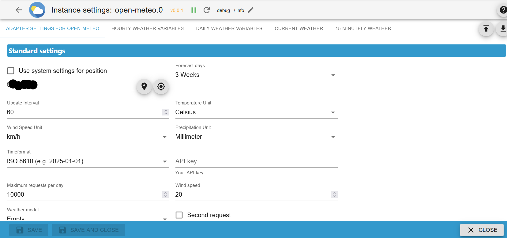
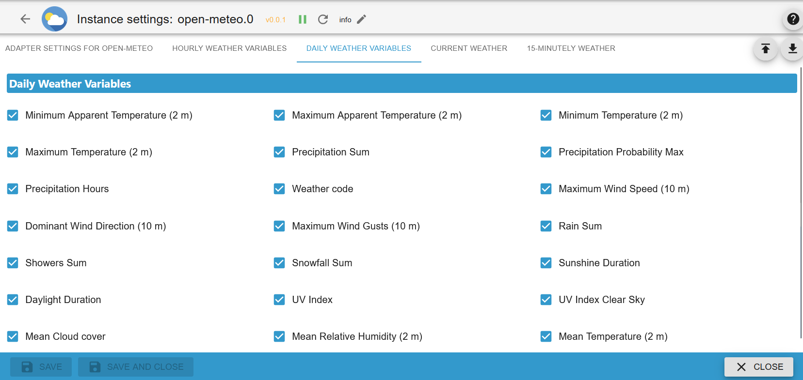
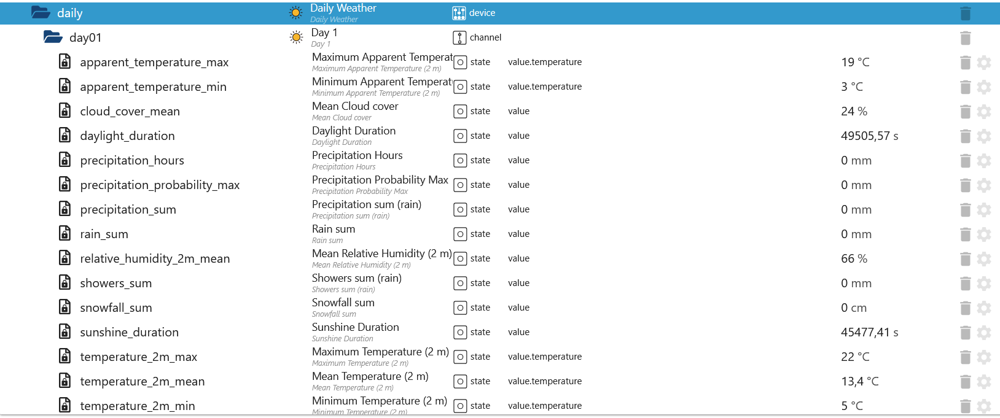
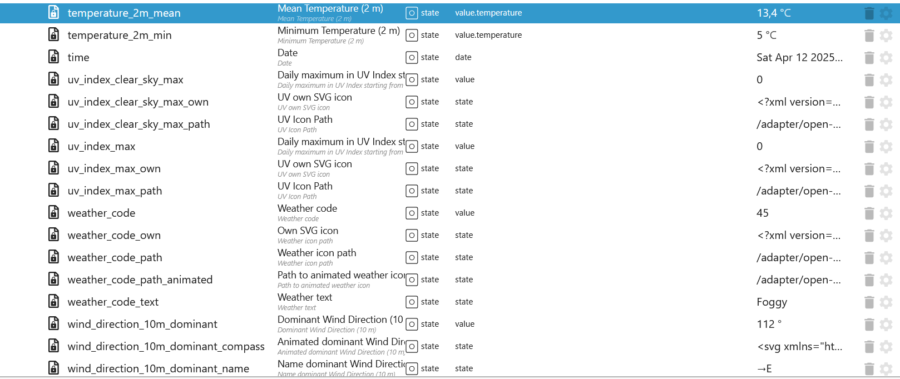
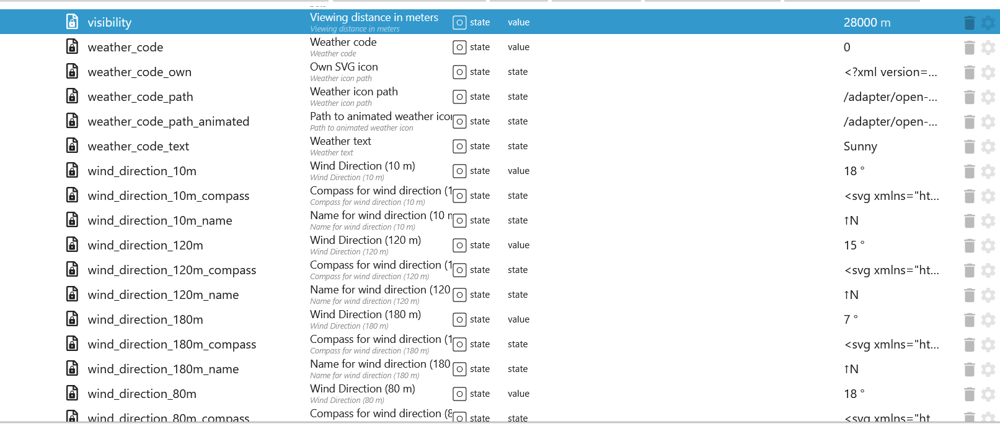
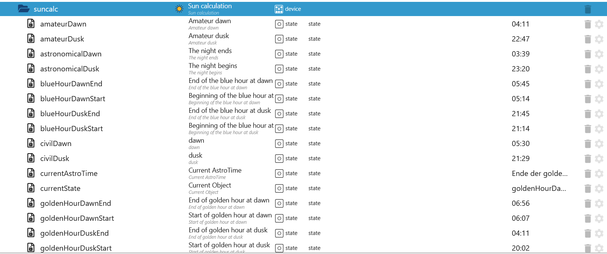
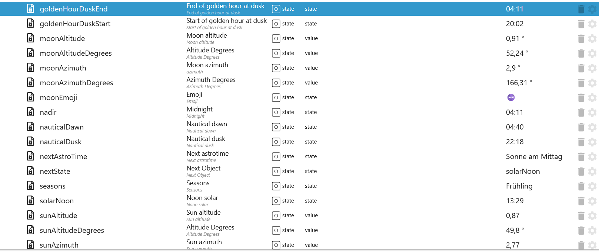
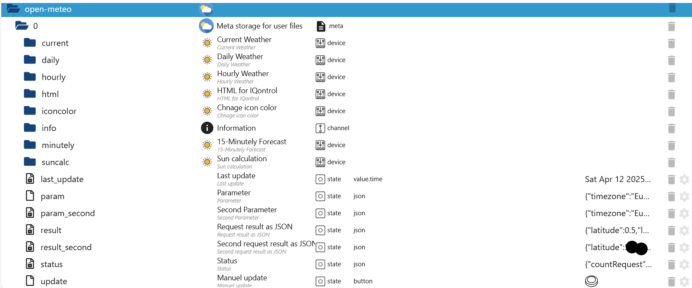

# ioBroker.open-meteo

[Back to the README](/README.md)

# Summary

- [Instance settings](#instance-settings)
    - [Default settings](#default-instance-settings)
    - [Hourly settings](#hourly-instance-settings)
    - [Current settings](#current-instance-settings)
    - [Daily settings](#daily-instance-settings)
    - [15-Minutely settings](#15-minutely-instance-settings)
- [Daily States](#objekte-daily)
- [Current States](#objekte-current)
- [Hourly States](#objekte-hourly)
- [15-Minutely](#objekte-15-minutely)
- [Astrotime](#astrotime)
- [Remote Control](#remote-control)

# Instance settings

### Default instance settings

[Summary](#summary)

| Settings                         | Description                                                 |
| -------------------------------- | ----------------------------------------------------------- |
| Use system settings for position | Choose between automatic or manual input                    |
| Forecast days                    | Choose between 1-7 days                                     |
| Update Interval                  | Update interval in minutes (max. 10,000 requests per day)   |
| Temperature Unit                 | Choose between celsius or fahrenheit                        |
| Wind Speed Unit                  | Choose between km/h, m/s, mph or knots                      |
| Precipitation Unit               | Choose between millimeter or inch                           |
| Timeformat                       | Choose between ISO 8610 (e.g. 2025-01-01) or Unix timestamp |
| API key                          | Your API Key                                                |
| Maximum requests per day         | Maximum queries per day. 10,000 by default for a free API.  |



### Hourly instance settings

[Summary](#summary)

| Settings                              | Description                                                                  |
| ------------------------------------- | ---------------------------------------------------------------------------- |
| Temperature (2 m)                     | Air temperature at 2 meters above ground                                     |
| Temperature (80 m)                    | Air temperature at 80 meters above ground                                    |
| Temperature (120 m)                   | Air temperature at 120 meters above ground                                   |
| Temperature (180 m)                   | Air temperature at 180 meters above ground                                   |
| Apparent Temperature                  | Apparent temperature                                                         |
| Precipitation (rain + showers + snow) | Total precipitation (rain, showers, snow) sum of the preceding hour          |
| Precipitation probability             | Probability of precipitation with more than 0.1 mm of the preceding hour     |
| Weather code                          | Weather condition as a numeric code and string                               |
| Wind Speed (10 m)                     | Wind speed at 10 meters above ground                                         |
| Wind Speed (80 m)                     | Wind speed at 80 meters above ground                                         |
| Wind Speed (120 m)                    | Wind speed at 120 meters above ground                                        |
| Wind Speed (180 m)                    | Wind speed at 180 meters above ground                                        |
| Wind Direction (10 m)                 | Wind direction at 10 meters above ground                                     |
| Wind Direction (80 m)                 | Wind direction at 80 meters above ground                                     |
| Wind Direction (120 m)                | Wind direction at 120 meters above ground                                    |
| Wind Direction (180 m)                | Wind direction at 180 meters above ground                                    |
| Wind Gusts (10 m)                     | Gusts at 10 meters above ground as a maximum of the preceding hour           |
| Relative Humidity (2 m)               | Relative humidity at 2 meters above ground                                   |
| Rain                                  | Rain from large scale weather systems of the preceding hour in millimeter    |
| Showers                               | Showers from convective precipitation in millimeters from the preceding hour |
| Snowfall                              | Snowfall amount of the preceding hour in centimeters                         |
| Snow depth                            | Snow depth on the ground                                                     |
| Soil Temperature (0 cm)               | Temperature in the soil at 0 cm depths                                       |
| Soil Temperature (6 cm)               | Temperature in the soil at 6 cm depths                                       |
| Soil Temperature (18 cm)              | Temperature in the soil at 18 cm depths                                      |
| Soil Temperature (54 cm)              | Temperature in the soil at 54 cm depths                                      |
| Soil Moisture (0-1 cm)                | Average soil water content as volumetric mixing ratio at 0-1 cm depths       |
| Soil Moisture (1-3 cm)                | Average soil water content as volumetric mixing ratio at 1-3 cm depths       |
| Soil Moisture (3-9 cm)                | Average soil water content as volumetric mixing ratio at 3-9 cm depths       |
| Soil Moisture (9-27 cm)               | Average soil water content as volumetric mixing ratio at 9-27 cm depths      |
| Soil Moisture (27-81 cm)              | Average soil water content as volumetric mixing ratio at 27-81 cm depths     |
| Viewing distance                      | Viewing distance in meters                                                   |
| Cloud cover                           | Total cloud cover as an area fraction                                        |
| Cloud cover low                       | Low level clouds and fog up to 3 km altitude                                 |
| Cloud cover mid                       | Mid level clouds from 3 to 8 km altitude                                     |
| Cloud cover high                      | High level clouds from 8 km altitude                                         |
| Dewpoint                              | Dew point temperature at 2 meters above ground                               |

</br>


### Current instance settings

[Summary](#summary)

| Settings                           | Description                                                       |
| ---------------------------------- | ----------------------------------------------------------------- |
| Minimum Apparent Temperature (2 m) | Minimum daily apparent temperature                                |
| Maximum Apparent Temperature (2 m) | Maximum daily apparent temperature                                |
| Minimum Temperature (2 m)          | Minimum daily air temperature at 2 meters above ground            |
| Maximum Temperature (2 m)          | Maximum daily air temperature at 2 meters above ground            |
| Precipitation Sum                  | Sum of daily precipitation (including rain, showers and snowfall) |
| Precipitation Probability Max      | Probability of precipitation                                      |
| Precipitation Hours                | The number of hours with rain                                     |
| Weather code                       | The most severe weather condition on a given day                  |
| Maximum Wind Speed (10 m)          | Maximum wind speed on a day                                       |
| Dominant Wind Direction (10 m)     | Dominant wind direction                                           |
| Maximum Wind Gusts (10 m)          | Maximum wind gusts on a day                                       |
| Rain Sum                           | Sum of daily rain                                                 |
| Showers Sum                        | Sum of daily showers                                              |
| Snowfall Sum                       | Sum of daily snowfall                                             |
| Sunshine Duration                  | The number of seconds of sunshine per day                         |
| Daylight Duration                  | Number of seconds of daylight per day                             |
| Cloud cover                        | Total cloud cover as an area fraction                             |


### Daily instance settings

[Summary](#summary)

| Settings                | Description                                                                  |
| ----------------------- | ---------------------------------------------------------------------------- |
| Temperature (2 m)       | Air temperature at 2 meters above ground                                     |
| Apparent Temperature    | Apparent temperature                                                         |
| Precipitation           | Total precipitation (rain, showers, snow) sum of the preceding hour          |
| Weather code            | Weather condition as a numeric code and string                               |
| Wind Speed (10 m)       | Wind speed at 10 meters above ground                                         |
| Wind Direction (10 m)   | Wind direction at 10 meters above ground                                     |
| Wind Gusts (10 m)       | Gusts at 10 meters above ground as a maximum of the preceding hour           |
| Relative Humidity (2 m) | Relative humidity at 2 meters above ground                                   |
| Rain                    | Rain from large scale weather systems of the preceding hour in millimeter    |
| Showers                 | Showers from convective precipitation in millimeters from the preceding hour |
| Snowfall                | Snowfall amount of the preceding hour in centimeters                         |
| UV Index                | Daily maximum in UV Index starting from 0                                    |
| UV Index Clear Sky      | Daily maximum in UV Index starting from 0 on assumes cloud free conditions   |



### 15-Minutely instance settings

[Summary](#summary)

| Settings                              | Description                                                               |
| ------------------------------------- | ------------------------------------------------------------------------- |
| Precipitation (rain + showers + snow) | Total precipitation (rain, showers, snow) sum of the preceding hour       |
| Freezing Level Height                 | Altitude above sea level of the 0°C level                                 |
| Sunshine Duration                     | The number of seconds of sunshine per day                                 |
| Rain                                  | Rain from large scale weather systems of the preceding hour in millimeter |
| CAPE                                  | Convective available potential energy                                     |
| Snowfall                              | Snowfall amount of the preceding hour in centimeters                      |
| Lightning Potential Index LPI         | The Lightning Potential Index                                             |
| Snowfall Height                       | Height of snowfall limit above mean sea level                             |
| Is Day or Night                       | true for day and false for night                                          |


### Objekte Current

[Summary](#summary)

| Objects              | Description                                                                                                                                                      |
| -------------------- | ---------------------------------------------------------------------------------------------------------------------------------------------------------------- |
| apparent_temperature | Apparent temperature is the perceived feels-like temperature combining wind chill factor, relative humidity and solar radiation                                  |
| cloud_cover          | Total cloud cover as an area fraction                                                                                                                            |
| precipitation        | Total precipitation (rain, showers, snow) sum of the preceding hour                                                                                              |
| rain                 | Rain from large scale weather systems of the preceding hour in millimeter                                                                                        |
| relative_humidity_2m | Relative humidity at 2 meters above ground                                                                                                                       |
| showers              | Showers from convective precipitation in millimeters from the preceding hour                                                                                     |
| snowfall             | Snowfall amount of the preceding hour in centimeters. For the water equivalent in millimeter, divide by 7. E.g. 7 cm snow = 10 mm precipitation water equivalent |
| temperature_2m       | Air temperature at 2 meters above ground                                                                                                                         |
| time                 | Date                                                                                                                                                             |
| weather_code         | Weather condition as a numeric code.                                                                                                                             |
| weather_code_text    | Weather condition as a string code.                                                                                                                              |
| wind_speed_10m       | Wind speed at 10 meters above ground.                                                                                                                            |


### Objekte Daily

[Summary](#summary)

| Objects                       | Description                                                                                                                 |
| ----------------------------- | --------------------------------------------------------------------------------------------------------------------------- |
| apparent_temperature_max      | Maximum daily apparent temperature                                                                                          |
| apparent_temperature_min      | Minimum daily apparent temperature                                                                                          |
| daylight_duration             | Number of seconds of daylight per day                                                                                       |
| precipitation_hours           | The number of hours with rain                                                                                               |
| precipitation_probability_max | Sum of daily precipitation (including rain, showers and snowfall)                                                           |
| precipitation_sum             | Sum of daily precipitation (including rain, showers and snowfall)                                                           |
| rain_sum                      | Sum of daily rain                                                                                                           |
| showers_sum                   | Sum of daily showers                                                                                                        |
| snowfall_sum                  | Sum of daily snowfall                                                                                                       |
| sunshine_duration             | Number of seconds of sunshine of the preceding hour per hour calculated by direct normalized irradiance exceeding 120 W/m². |
| temperature_2m_max            | Maximum daily air temperature at 2 meters above ground                                                                      |
| temperature_2m_min            | Minimum daily air temperature at 2 meters above ground                                                                      |
| time                          | Date                                                                                                                        |
| uv_index_clear_sky_max        | UV-Index on clear sky                                                                                                       |
| uv_index_max                  | UV Index                                                                                                                    |
| weather_code                  | Weather condition as a numeric code.                                                                                        |
| weather_code_text             | Weather condition as a string code.                                                                                         |
| wind_direction_10m_dominant   | Dominant wind direction                                                                                                     |
| wind_speed_10m_max            | Maximum wind speed on a day                                                                                                 |
| wind_gusts_10m_max            | Maximum gusts speed on a day                                                                                                |

</br>


### Objekte Hourly

[Summary](#summary)

| Objects                   | Description                                                                                                                                                      |
| ------------------------- | ---------------------------------------------------------------------------------------------------------------------------------------------------------------- |
| apparent_temperature      | Apparent temperature is the perceived feels-like temperature combining wind chill factor, relative humidity and solar radiation                                  |
| cloud_cover               | Total cloud cover as an area fraction                                                                                                                            |
| cloud_cover_high          | High level clouds from 8 km altitude                                                                                                                             |
| cloud_cover_low           | Low level clouds and fog up to 3 km altitude                                                                                                                     |
| cloud_cover_mid           | Mid level clouds from 3 to 8 km altitude                                                                                                                         |
| precipitation             | Total precipitation (rain, showers, snow) sum of the preceding hour                                                                                              |
| dew_point_2m              | Dew point temperature at 2 meters above ground                                                                                                                   |
| precipitation_probability | Precipitation probability                                                                                                                                        |
| snow_depth                | Snow depth on the ground                                                                                                                                         |
| snowfall                  | Snowfall amount of the preceding hour in centimeters. For the water equivalent in millimeter, divide by 7. E.g. 7 cm snow = 10 mm precipitation water equivalent |
| soil_moisture_0_to_1_cm   | Average soil water content as volumetric mixing ratio at 0-1 cm depths.                                                                                          |
| soil_moisture_1_to_3_cm   | Average soil water content as volumetric mixing ratio at 1-3 cm depths.                                                                                          |
| soil_moisture_27_to_81_cm | Average soil water content as volumetric mixing ratio at 27-81 cm depths.                                                                                        |
| soil_moisture_3_to_9_cm   | Average soil water content as volumetric mixing ratio at 3-9 cm depths.                                                                                          |
| soil_moisture_9_to_27_cm  | Average soil water content as volumetric mixing ratio at 9-27 cm depths.                                                                                         |
| soil_temperature_0cm      | Temperature in the soil at 0 cm depths. 0 cm is the surface temperature on land or water surface temperature on water.                                           |
| soil_temperature_18cm     | Temperature in the soil at 18 cm depths. 0 cm is the surface temperature on land or water surface temperature on water.                                          |
| soil_temperature_54cm     | Temperature in the soil at 54 cm depths. 0 cm is the surface temperature on land or water surface temperature on water.                                          |
| soil_temperature_6cm      | Temperature in the soil at 6 cm depths. 0 cm is the surface temperature on land or water surface temperature on water.                                           |
| temperature_120m          | Air temperature at 120 meters above ground                                                                                                                       |
| temperature_180m          | Air temperature at 180 meters above ground                                                                                                                       |
| temperature_2m            | Air temperature at 2 meters above ground                                                                                                                         |
| temperature_80m           | Air temperature at 80 meters above ground                                                                                                                        |
| time                      | Date                                                                                                                                                             |
| visibility                | Viewing distance in meters. Influenced by low clouds, humidity and aerosols.                                                                                     |
| weather_code              | Weather condition as a numeric code.                                                                                                                             |
| weather_code_text         | Weather condition as a string code.                                                                                                                              |
| wind_direction_10m        | Wind direction at 10 meters above ground                                                                                                                         |
| wind_direction_120m       | Wind direction at 120 meters above ground                                                                                                                        |
| wind_direction_180m       | Wind direction at 180 meters above ground                                                                                                                        |
| wind_direction_80m        | Wind direction at 80 meters above ground                                                                                                                         |
| wind_gusts_10m            | Gusts at 10 meters above ground as a maximum of the preceding hour                                                                                               |
| wind_speed_10m            | Wind speed at 10 meters above ground.                                                                                                                            |
| wind_speed_120m           | Wind speed at 120 or 180 meters above ground.                                                                                                                    |
| wind_speed_180m           | Wind speed at 180 meters above ground.                                                                                                                           |
| wind_speed_80m            | Wind speed at 80 meters above ground.                                                                                                                            |

</br>
</br>
</br>
</br>


### Objekte 15-Minutely

[Summary](#summary)

| Objects               | Description                                                                                                                                                      |
| --------------------- | ---------------------------------------------------------------------------------------------------------------------------------------------------------------- |
| cape                  | Convective available potential energy                                                                                                                            |
| freezing_level_height | Altitude above sea level of the 0°C level                                                                                                                        |
| is_day                | is Day or Night                                                                                                                                                  |
| lightning_potential   | The Lightning Potential Index                                                                                                                                    |
| precipitation         | Total precipitation (rain, showers, snow) sum of the preceding hour                                                                                              |
| rain                  | Rain from large scale weather systems of the preceding hour in millimeter                                                                                        |
| snowfall              | Snowfall amount of the preceding hour in centimeters. For the water equivalent in millimeter, divide by 7. E.g. 7 cm snow = 10 mm precipitation water equivalent |
| snowfall_height       | Height of snowfall limit above mean sea level                                                                                                                    |
| sunshine_duration     | Number of seconds of sunshine of the preceding hour per hour calculated by direct normalized irradiance exceeding 120 W/m².                                      |
| time                  | Date                                                                                                                                                             |

</br>
</br>


### Astrotime

[Summary](#summary)

🟢 Updated at 2:01 AM</br>
🔴 minute update

| Object              | Description                           |
| ------------------- | ------------------------------------- |
| amateurDawn         | Amateur dawn 🟢                       |
| amateurDusk         | Amateur dusk 🟢                       |
| astronomicalDawn    | Astronomical dawn 🟢                  |
| astronomicalDusk    | Astronomical dusk 🟢                  |
| blueHourDawnEnd     | End of the blue hour at dawn 🟢       |
| blueHourDawnStart   | Beginning of the blue hour at dawn 🟢 |
| blueHourDuskEnd     | End of the blue hour at dusk 🟢       |
| blueHourDuskStart   | Beginning of the blue hour at dusk 🟢 |
| civilDawn           | Dawn 🟢                               |
| civilDusk           | Dusk 🟢                               |
| currentAstroTime    | current AstroTime 🔴                  |
| currentState        | current Object (State - Name) 🔴      |
| goldenHourDawnEnd   | End of golden hour at dawn 🟢         |
| goldenHourDawnStart | Beginning of golden hour at dawn 🟢   |
| goldenHourDuskEnd   | End of golden hour at dusk 🟢         |
| goldenHourDuskStart | Beginning of golden hour at dusk 🟢   |
| moonAltitudeDegrees | Altitude Degrees 🔴                   |
| moonAzimuthDegrees  | Azimuth 🔴                            |
| moonElevation       | Moon elevation 🔴                     |
| moonEmoji           | Moon Emoji 🔴                         |
| nadir               | Nadir 🔴                              |
| nauticalDawn        | Nautical dawn 🟢                      |
| nauticalDusk        | Nautical dusk 🟢                      |
| nextAstroTime       | next Astrozeit 🔴                     |
| nextState           | next Object (State - Name) 🔴         |
| seasons             | Seasons 🟢                            |
| solarNoon           | Solar noon 🟢                         |
| sunAltitudeDegrees  | Sun altitude degrees 🔴               |
| sunAzimuthDegrees   | Sun azimuth degrees 🔴                |
| sunElevation        | Elevation 🔴                          |
| sunriseEnd          | Sunrise end 🟢                        |
| sunriseStart        | Sunrise start 🟢                      |
| sunsetEnd           | Sunset end 🟢                         |
| sunsetStart         | Sunset start 🟢                       |

</br>
</br>


### Remote Control

[Summary](#summary)

| Objects     | Description                                         |
| ----------- | --------------------------------------------------- |
| last_update | Last update                                         |
| param       | Own parameters (see https://open-meteo.com/en/docs) |
| result      | Result of your own parameters or interval query     |
| status      | Status and counter of requests                      |
| update      | Manual update                                       |

### Status JSON

```json
{
    "countRequest": 8, // Counter per request (0.1 per variable and 0.75 per day -> max 14 per request)
    "countRequestMax": 10000, // Max requests per day. Default 10000 per day - with API > 30000
    "timestamp": 1742237803609, // Last request as a timestamp
    "timeISO": "2025-03-17T18:56:43.609Z", // Last request as a date
    "countError": 0, // Error counter. Resets after a restart
    "error": "NoError", // Last error message
    "timestampError": 0, // Last error as a timestamp
    "lastError": "2025-03-17T18:56:23.083Z", // Last error as a date
    "timestampRestart": 1742237783083, // Last adapter start as a timestamp
    "timeISORestart": "2025-03-17T18:56:23.083Z" // Last adapter start as a date
}
```



[Zusammenfassung](#zusammenfassung)
